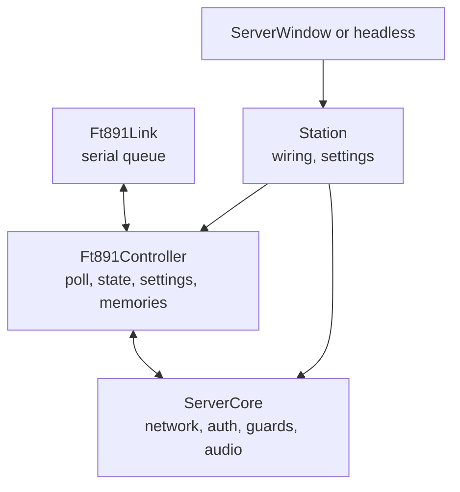

# Architecture

## Repository layout

| Folder | Contents |
|---|---|
| `common/` | the control protocol, the CAT description loader, FT-891 helpers (modes, bands, WIDTH table, frequency parser), the audio engine (PortAudio; Oboe on Android), Opus, encryption |
| `server/` | the serial link, the FT-891 controller, the network core, the station wiring, the window and the headless daemon, serial port recognition |
| `client/` | the network and audio core, the rigctld port, and `qml/`: the bridge to QML and the pages |
| `data/cat/` | `ft891.json`, the CAT description, and its format |
| `test/` | the simulator, the test programs, the QML tests |
| `packaging/` | Debian packaging, systemd unit, manual pages, AppStream, build dependencies |
| `android/` | the Android manifest, activity and service |
| `installer/` | the Windows installer script |

## The server

- **Ft891Link** owns the serial port. Requests wait in queues by priority —
  operator commands, read-backs, polling, background reads — one request in
  flight at a time. An answer is matched to the request by what it starts
  with, not by the order requests went out; a request may carry its own
  timeout.
- **Ft891Controller** polls frequency, mode, TX state and meters, and one
  front-panel setting per cycle; keeps the radio's state and the value of
  every setting; checks every value against the description before sending
  it and reads it back after; reads the memories one at a time.
- **ServerCore** handles the network: the handshake, the password, the
  commands of the client, the audio, and the guards (dead man, band edges,
  tuner cycle and keyer apart from the PTT).
- **Station** wires them together and loads the settings, for the window and
  the daemon alike.

## The client

- **ClientCore** runs the connection and the audio in its own thread.
- **Ft891Bridge** exposes the radio to QML: state, values, the description
  of every command, and the actions.
- The **QML pages** are drawn from the description: `SettingRow` turns a
  command into a switch, segments, a list, a slider or a text field.
- **RigctldServer** is the rigctld-compatible port.

## The control protocol

TCP carries the control, UDP the audio. The handshake starts with the magic
`F891` — the programs do not talk to RemoteRig — then a challenge, the
client's answer built from the password, and `authOk`. After that, JSON
messages:

| Message | Direction | Meaning |
|---|---|---|
| `state` | server → client | frequency, mode, VFO/memory, TX, meters… |
| `vals` | server → client | settings and memories that changed (deltas) |
| `progress` | server → client | Read all progress |
| `notice`, `error` | server → client | messages for the operator |
| `cmd` | client → server | set a setting, tune, PTT, memory read/write/recall… |
| `ping`, `pong` | both | liveness and round-trip time |

Memories travel as settings named `MEM:<channel>`.

## Changing a setting

1. The client sends `cmd` `set` with the code and the values.
2. The server checks them against the description (and the WIDTH table for
   the current mode), builds the CAT frame and sends it.
3. It reads the setting back, and sends the new value to the client in a
   `vals` delta: the display always shows what the radio kept, not what was
   asked.
