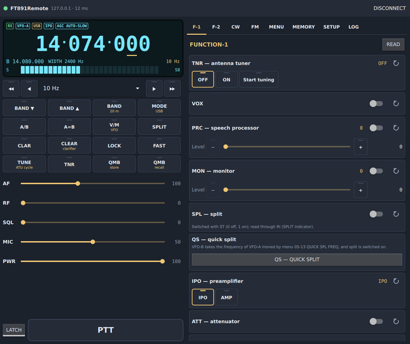
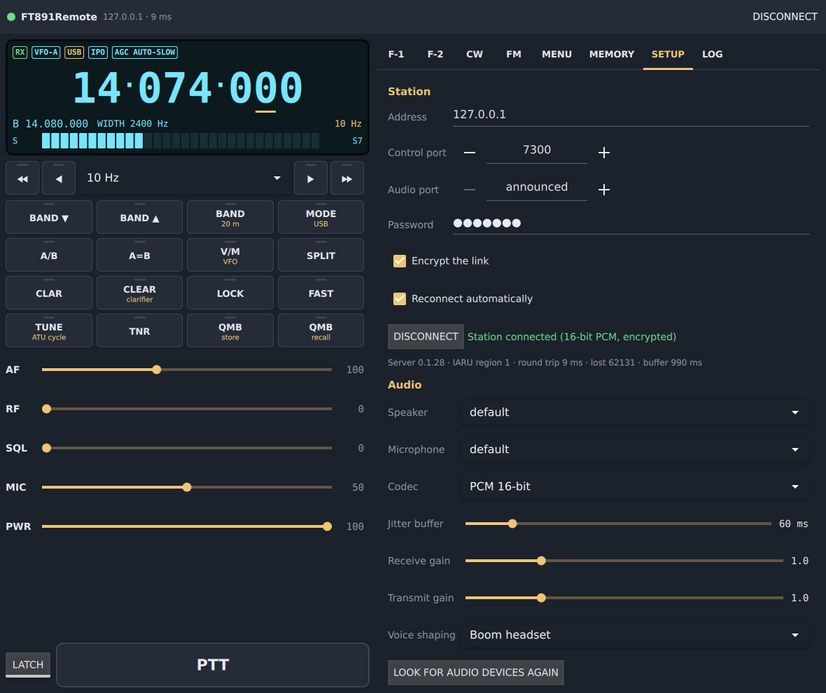
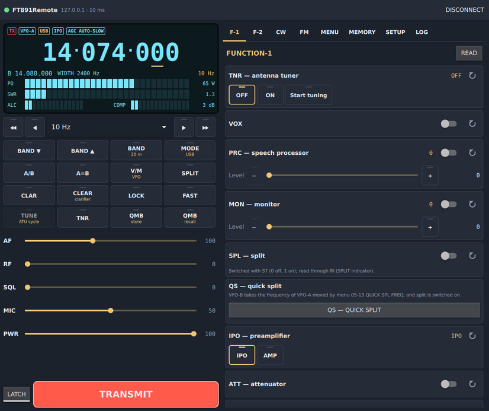
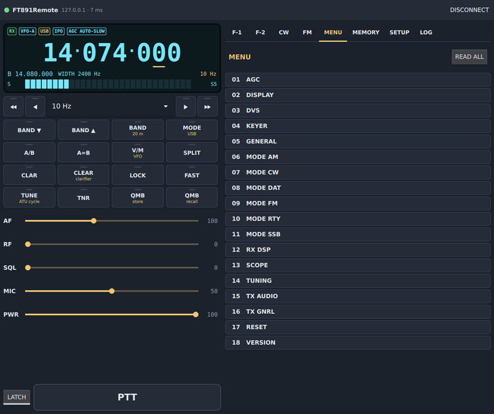
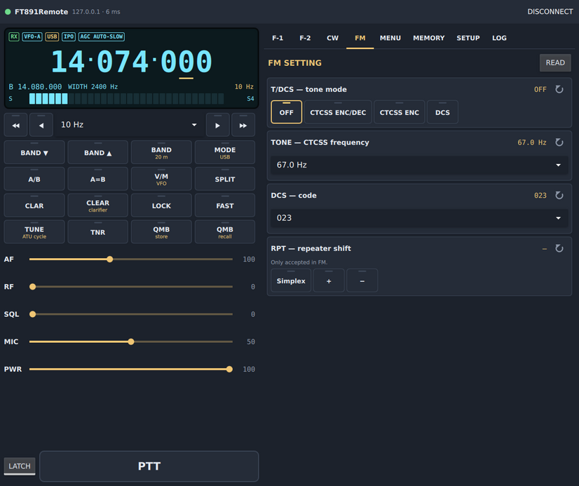
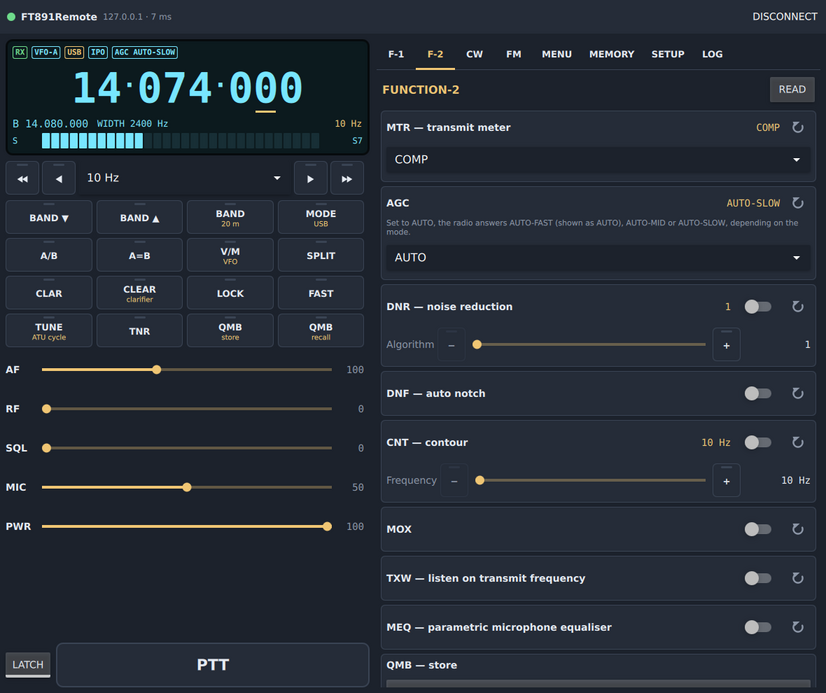
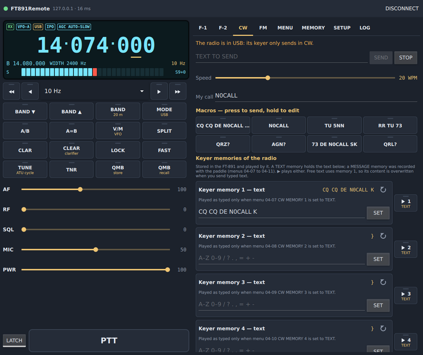
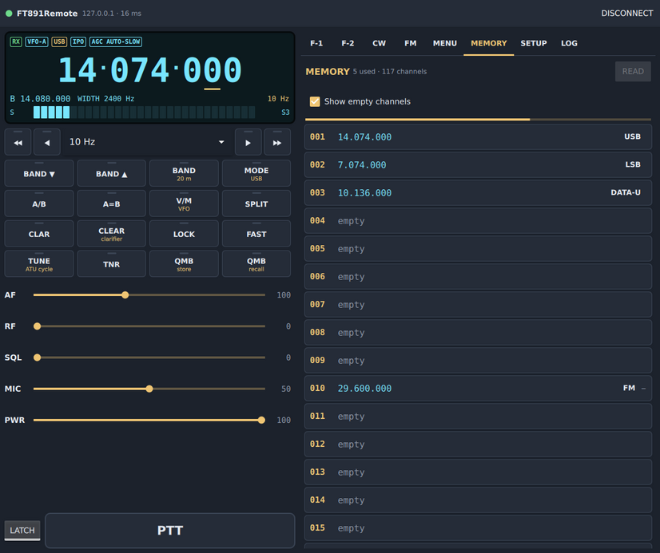
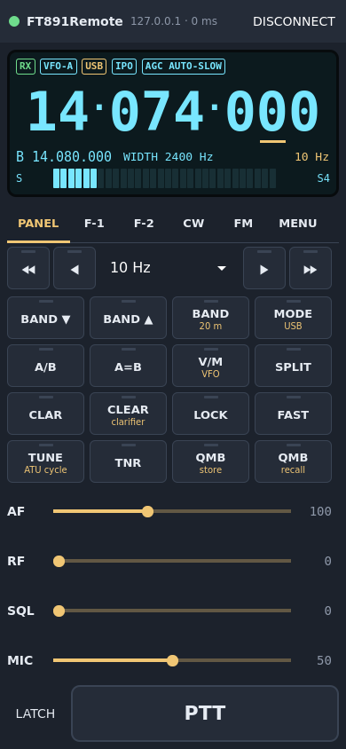
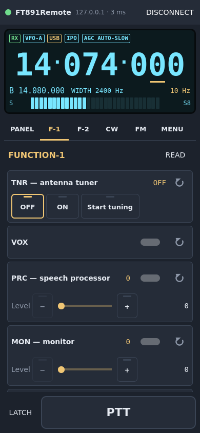

# Client

`ft891remote` is the operating position: one Qt Quick program for the
desktop and Android, with the same pages on both.

## Connecting

Open **SETUP**, enter the server's **address** and **password**, and press
**Connect**. The control port (TCP 7300) and the audio port (UDP 7301,
announced by the server) rarely need changing. **Encrypt the link** and
**Reconnect automatically** are on by default; the line under the button
shows the server's version, its IARU region, the round-trip time, lost
packets and the audio buffer.

SETUP also holds the audio devices (speaker, microphone), the codec (Opus or
16-bit PCM), the jitter buffer, the receive and transmit gains, voice
shaping, the **rigctld interface** (see [Digital Modes](Digital-Modes)),
**PTT on the volume-down key** (Android), and the radio's power switch.

## The display

The LCD shows the frequency, the mode the radio reports, VFO-B, the filter
width, the status flags (RX or TX, VFO or MEM and channel, IPO, ATT, NAR,
NB, DNR, DNF, NCH, CNT, PROC, VOX, MON, TNR, LOCK, FAST, AGC, SPL, CLAR,
SHIFT), the warnings (HI SWR, TUNING, KEYING, OUT OF BAND), and the S-meter
in receive — or PO, SWR, ALC and COMP in transmit.

## Tuning

- **Mouse wheel** on the frequency; **Shift** for ten steps.
- **Drag** on a touch screen.
- The **arrow keys** of the panel, and the step selector.
- **Direct entry**: click the frequency — or the VFO-B line for VFO-B — and
  type it: `14.074`, `14074`, `14074000`, `7100 kHz` or the display form
  `7.100.000`.

## The panel

BAND up/down and direct band, MODE, A/B, A=B, V/M, SPLIT, CLAR with its
offset, CLEAR, LOCK, FAST, **TUNE** (an ATU cycle; lit red while tuning,
then lit as long as the tuner is on), TNR, QMB store and recall; AF, RF, SQL,
MIC and PWR.

The **MODE** key offers the radio's six families — SSB, CW, AM, FM, RTTY,
DATA. For SSB the sideband follows the band (LSB below 10 MHz, USB above and
on 60 m); the other families come back to the variant last used (CW-L,
DATA-L…).

**PTT**: hold the PTT key, or the **space bar** when no text field has the
focus, or the phone's **volume-down** key; **LATCH** keeps it down.

## The pages

| Page | What it holds |
|---|---|
| **F-1** | the FUNCTION-1 settings: tuner, VOX, processor, monitor, split, IPO/AMP, ATT, NAR, NB, IF SHIFT, WIDTH, notch… |
| **F-2** | FUNCTION-2: meter, AGC, DNR, DNF, contour, MOX, TXW, parametric EQ, QMB, scan, voice memory playback |
| **CW** | keyboard, speed, macros, the radio's keyer memories, CW settings |
| **FM** | repeater shift, tone and DCS |
| **MENU** | the radio's whole menu, 01 AGC to 18 VERSION |
| **MEMORY** | memory channels 001–099 and P1L–P9U |
| **SETUP** | connection, audio, controls, radio power |
| **LOG** | the client's log |

| MENU | FM |
|---|---|
|  |  |

Each setting is drawn from the [CAT description](CAT-Description): a switch
for OFF/ON, segments or a list for a choice, a slider for a range. A function
and its setting share one section — the switch and the value in the title
line, the slider below: PRC and its level, MON and its level, NB and its
level, NCH and its frequency, DNR and its algorithm, CNT and its frequency,
APF and its offset, IF SHIFT and WIDTH.

The WIDTH slider offers only the steps the current mode has (they depend on
the mode and on NARROW), and shows the bandwidth of each.

**READ** on a page reads its settings again; **READ ALL** on the MENU page
reads every setting, every menu entry and every memory, with a progress bar.
The ↻ key of a row reads that one setting.

## CW

Type in the keyboard field and send; the text goes to the radio's keyer.
Eight macros accept `{MYCALL}`. The five **keyer memories** of the radio can
be edited (TEXT memories) and played with ▶: a memory set to TEXT is played
with `KY6`–`KYA`, one set to MESSAGE (recorded with the paddle) with
`KY1`–`KY5` — the row shows which. The speed, pitch, keyer, break-in and its
delay, APF, zero-in and spot are on the same page.

## Memories

The MEMORY page lists channels 001–099 and the PMS pairs P1L–P9U, read from
the radio the first time the page opens (or with **READ ALL**). Tap a channel
to edit it: frequency, mode, clarifier and its offset, CTCSS on/off and
repeater shift — or **From VFO-A** to take where the radio stands. **Write**
sends it to the radio (after a confirmation when the channel is not empty)
and reads it back; **Recall** selects it on the radio.

Over CAT a memory holds neither its CTCSS tone frequency nor its name: the
FT-891 does not send or take them. There is no CAT command to clear a
memory; clear it from the radio.

## The phone

The same program on Android, in portrait, full screen. The panel has its own
tab; the pages scroll.

| Panel | F-1 |
|---|---|
|  |  |
