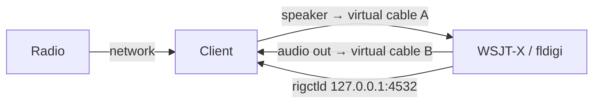

# Digital Modes

The client has a **rigctld-compatible port** on `127.0.0.1:4532`. Programs
that can drive a radio through Hamlib's rigctld — WSJT-X, JS8Call, fldigi,
and others — drive the remote FT-891 through it: frequency, mode, split and
PTT. Enable it in the client's **SETUP** page, under Controls.

The audio goes through the client's sound devices: the digital-mode program
listens to what the client plays, and the client transmits what the program
plays. On one computer that takes a **virtual audio cable**.

## On the radio

Use the DATA modes, and let their modulation come from USB: **08-09 DATA IN
SELECT = REAR**. With CAT PTT nothing else is needed; with RTS/DTR PTT, set
**08-10 DATA PTT SELECT** (and **09-03 PKT PTT SELECT** for FM packet).

## Audio routing

**Windows** — install a virtual cable (for example VB-Audio Virtual Cable,
or two of them). In the client, set the **speaker** to "CABLE Input"; in the
digital program, set the input to "CABLE Output". For transmit, set the
program's output to a second cable and the client's **microphone** to that
cable's output.

**Linux** — create a null sink with PipeWire or PulseAudio
(`pactl load-module module-null-sink sink_name=ft891`), set the client's
speaker to it and the program's input to its monitor; for transmit, the
reverse with a second sink.

Keep the client's **transmit gain** and the program's output level low
enough for ALC to stay quiet on the display.

## WSJT-X and JS8Call

Settings → Radio:

| Setting | Value |
|---|---|
| Rig | Hamlib NET rigctl |
| Network Server | `127.0.0.1:4532` |
| PTT Method | CAT |
| Mode | Data/Pkt |
| Split Operation | Rig, or Fake It |

**Test CAT** and **Test PTT** should both succeed.

## fldigi

Configure → Rig Control → Hamlib:

| Setting | Value |
|---|---|
| Use Hamlib | on |
| Rig | Hamlib NET rigctl |
| Device | `127.0.0.1:4532` |
| PTT via Hamlib command | on |

Press **Initialize**. fldigi's Hamlib names the VFO in every command
(`F VFOA 7030000`, `T VFOA 3`); the port handles that, and a change of
frequency or a transmission reaches the radio within a fraction of a second.

## What the port answers

- Frequency and mode act on the receive VFO, VFO-A, whichever VFO a program
  names: the FT-891 receives on VFO-A. Split sets VFO-B (`I`, `i`).
- Modes: `USB`, `LSB`, `CW`, `CWR`, `AM`, `FM`, `RTTY`, `RTTYR`, `PKTUSB`,
  `PKTLSB`, `PKTFM`.
- PTT: `T 1`, and `T 3` for data, as fldigi sends it.
- An invalid value is answered `RPRT -1`; a command the FT-891 cannot do,
  `RPRT -11`.

The port listens on the loopback interface only.
