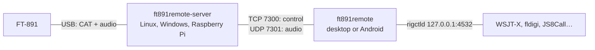

# FT891Remote

Remote operation of a **Yaesu FT-891** over a network: two-way audio, PTT,
and every setting the radio exposes over CAT — the FUNCTION keys, CW and FM
settings, the keyer memories, the memory channels and the whole MENU, from
01 AGC to 18 VERSION — from a desktop or an Android phone.

## How it fits together

- The **server** runs next to the radio, with a window or as a headless
  daemon. It speaks the FT-891's own CAT protocol — no Hamlib — polls the
  radio, guards the transmitter and carries the audio.
- The **client** is one Qt Quick program for the desktop and Android: an LCD
  display, the front-panel keys and knobs, and pages drawn from a complete
  description of the radio's CAT commands.
- A **rigctld-compatible port** in the client lets digital-mode programs
  drive the radio as if it were local.

## Where to start

| I want to… | Read |
|---|---|
| Install the programs | [Installation](Installation) |
| Prepare the FT-891 | [Radio Setup](Radio-Setup) |
| Run the station | [Server](Server) |
| Operate | [Client](Client) |
| Run FT8, PSK, RTTY… remotely | [Digital Modes](Digital-Modes) |
| Reach the station from outside | [Remote Access and Security](Remote-Access-and-Security) |
| Build it myself | [Building from Source](Building-from-Source) |
| Understand the CAT layer | [CAT Description](CAT-Description) |
| Check a radio or a change | [Testing](Testing) |
| Fix a problem | [Troubleshooting](Troubleshooting) |
| Work on the code | [Architecture](Architecture) |

## Highlights

- **Every CAT command, laid out as the radio lays it out**: 256 commands and
  the 159 MENU entries, each checked against the FT-891 CAT Operation
  Reference Book and tried on a real radio.
- **Memories**: channels 001–099 and the PMS pairs P1L–P9U, read, edited,
  written back and recalled.
- **CW** typed on the client and sent by the radio's own keyer, with macros
  and the radio's five keyer memories.
- **Safety**: dead-man PTT release, transmission refused outside the amateur
  bands of your IARU region (split and clarifier included), confirmations for
  reset, CAT-rate change and power-off.
- **Audio**: 48 kHz, Opus or 16-bit PCM, optional ChaCha20 encryption.

FT891Remote is derived from RemoteRig, a general remote-station program built
on Hamlib. It is released under the MIT licence. Yaesu and FT-891 are
trademarks of their owner, used only to say which radio this software works
with; this project is not affiliated with or endorsed by Yaesu.
