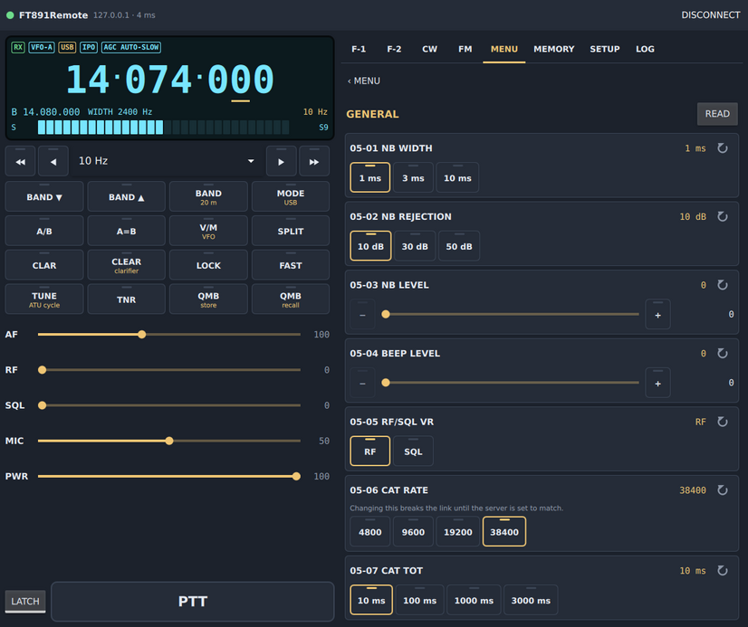

# Radio Setup

## The USB connection

Connect the FT-891's USB port to the server machine. The radio shows up as
two serial ports and a sound card:

| Device | Linux | Windows | Used for |
|---|---|---|---|
| Enhanced COM port | `/dev/ttyUSB0` | first COM of the pair | CAT |
| Standard COM port | `/dev/ttyUSB1` | second COM | RTS/DTR PTT or CW keying |
| USB Audio CODEC | ALSA / PulseAudio / PipeWire | "USB Audio CODEC" | audio |

The radio's USB chip, a Silicon Labs **CP2105**, is also the one in Yaesu's
**SCU-17** interface, with the same identifiers. The server therefore does
not trust the identifiers alone: until the radio has answered on a port, the
ports are shown as "CP2105 Enhanced COM" / "CP2105 Standard COM" with their
serial number. Once the FT-891 has answered, the server remembers its serial
number, labels both ports "FT-891" and follows the radio if Windows gives it
another COM number. See [Server](Server#choosing-the-cat-port).

## Menus to check on the radio

| Menu | Setting | Why |
|---|---|---|
| **05-06 CAT RATE** | 38400 (recommended) | the server's speed must match |
| **05-08 CAT RTS** | see below | RTS handshake on the CAT port |
| **11-05 SSB MIC SELECT** | REAR | modulation from USB in SSB |
| **06-05 AM MIC SELECT** | REAR | … in AM |
| **09-01 FM MIC SELECT** | REAR | … in FM |
| **08-09 DATA IN SELECT** | REAR | … in DATA (digital modes) |

**05-08 CAT RTS**: ENABLE is fine with CAT PTT — the server keeps RTS
asserted on the CAT port. With RTS PTT on the CAT port it must be DISABLE;
better, use the Standard COM port for RTS/DTR PTT.

When the PTT goes through the Standard COM port (RTS or DTR), set the PTT
source of each mode accordingly: **11-08 SSB PTT SELECT**, **06-07 AM PTT
SELECT**, **08-10 DATA PTT SELECT**, **09-03 PKT PTT SELECT**.

For CW typed on the client: **KEYER** on, **BK-IN** on to transmit, and the
keyer memory used for typed text on TEXT (menu **04-07 CW MEMORY 1**; the
server sets it itself when needed).

Once CAT works, all of these can be changed from the client's **MENU** page.

## Things the FT-891 does its own way

A few behaviours of the radio, found while building FT891Remote, that differ
from its CAT reference; the software handles them, but they explain what you
see. The full list is on the [CAT Description](CAT-Description#where-the-radio-and-the-reference-differ) page.

- RF GAIN runs 0–30.
- IF SHIFT and WIDTH have their own ON/OFF, set together with their value.
- The 60 m band has no band-stack key; FT891Remote reaches it by its preset
  frequency.
