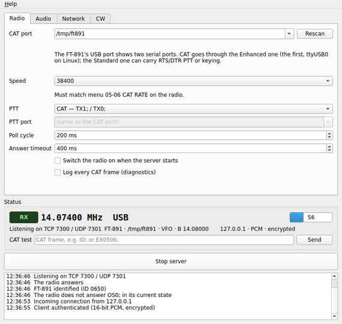
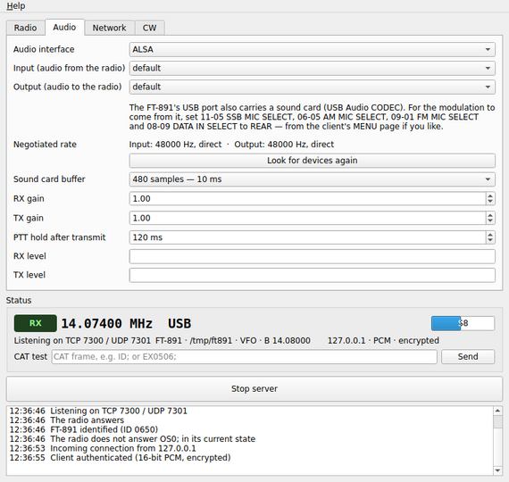
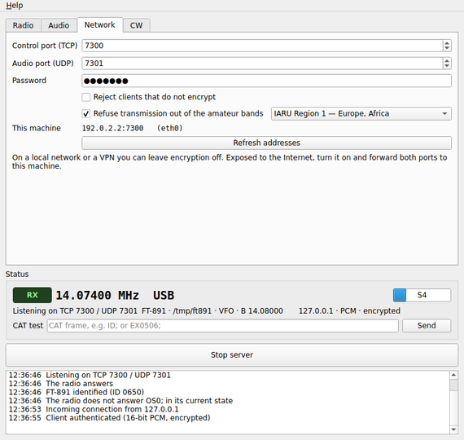

# Server

`ft891remote-server` runs next to the radio. It owns the CAT port, polls the
radio, carries the audio, and guards the transmitter. It runs with a window
or, once configured, as a headless daemon with the same settings.



## The Radio tab

| Setting | Meaning |
|---|---|
| **CAT port** | the FT-891's Enhanced COM port; type a name or path, or pick one |
| **Rescan** | looks for serial ports again, after plugging in the radio |
| **Speed** | must match menu 05-06 CAT RATE (38400 recommended) |
| **PTT** | `CAT — TX1; / TX0;`, RTS line, DTR line, or none (VOX or external) |
| **PTT port** | for RTS/DTR: the port whose line keys the radio — the FT-891's Standard COM port, or the CAT port itself |
| **Poll cycle** | how often frequency, mode, TX state and meters are read (200 ms) |
| **Answer timeout** | how long to wait for an answer before giving up (400 ms) |
| **Switch the radio on when the server starts** | sends the power-on sequence |
| **Log every CAT frame (diagnostics)** | writes every frame in and out to the log |

### Choosing the CAT port

The ports are scanned when the window opens. The FT-891 and the SCU-17 use
the same USB chip with the same identifiers, so until the radio has answered
none is selected on its own: choose the **Enhanced** one. Once the FT-891 has
answered `ID0650;` on it, the server remembers the radio's serial number,
labels both of its ports "FT-891", follows it to another COM number, and
offers its Standard port for PTT and keying.

### The status box

It shows what the server reads from the radio — TX state, frequency, mode,
S-meter — the ports in use and the connected client. The **CAT test** line
sends one frame straight to the radio and shows the answer, for diagnostics
(`TX` and `MX` frames are refused there: the PTT has its own guarded path).

## The Audio tab



Choose the **audio interface** (host API), the **input** (audio from the
radio: the FT-891's "USB Audio CODEC") and the **output** (audio to the
radio). The sound card buffer, the receive and transmit gains, and the
levels are here too; the negotiated sample rate is shown (48 kHz direct, or
resampled when the card cannot do 48 kHz).

## The Network tab



| Setting | Meaning |
|---|---|
| **Control port (TCP)** | 7300 by default |
| **Audio port (UDP)** | 7301 by default |
| **Password** | required from every client |
| **Reject clients that do not encrypt** | require the ChaCha20-encrypted link |
| **IARU region** | 1 Europe/Africa, 2 Americas, 3 Asia/Pacific |
| **Refuse transmission out of the amateur bands** | the band-edge guard |

The tab also lists the addresses this machine can be reached at.

## The CW tab

By default CW typed on the client is sent by the **radio's own keyer**: the
text is written into keyer memory 1 and played, fifty characters at a time.

Alternatively, **Generate CW here and key a serial line**: the server times
the elements itself and keys the RTS or DTR line of a serial port (the
FT-891's Standard COM port, or another interface), optionally inverted, with
or without holding the PTT during the message.

## Guards

- **Dead man**: if the client goes silent while transmitting, the PTT is
  released.
- **Band edges**: transmission is refused outside the amateur bands of the
  chosen IARU region, judging the emitted spectrum, split and clarifier
  included; the client shows OUT OF BAND.
- The **tuner cycle** and **keyer messages** are kept apart from the PTT.
- A **confirmation** is asked for a reset, a CAT-rate change or a power-off.

## Headless operation

Once configured in the window, the same settings run without a display:

```sh
ft891remote-server --headless            # the settings saved by the window
ft891remote-server --headless -v         # ... and log frequency changes
ft891remote-server --headless --config station.ini
ft891remote-server --list-audio          # device names for the .ini
ft891remote-server --list-ports
systemctl --user enable --now ft891remote-server
```

An `.ini` file uses the keys the window saves:

```ini
[General]
catPort=/dev/ttyUSB0
catBaud=38400
; CAT, RTS, DTR or NONE. pttPort empty: the CAT port itself.
pttMethod=CAT
pttPort=
password=choose-one
tcpPort=7300
udpPort=7301
audioIn=USB Audio CODEC
audioOut=USB Audio CODEC
; IARU region of the band-edge guard.
region=1
bandEdges=true
```

Comments must be on lines of their own: nothing may follow a value on its
line.
