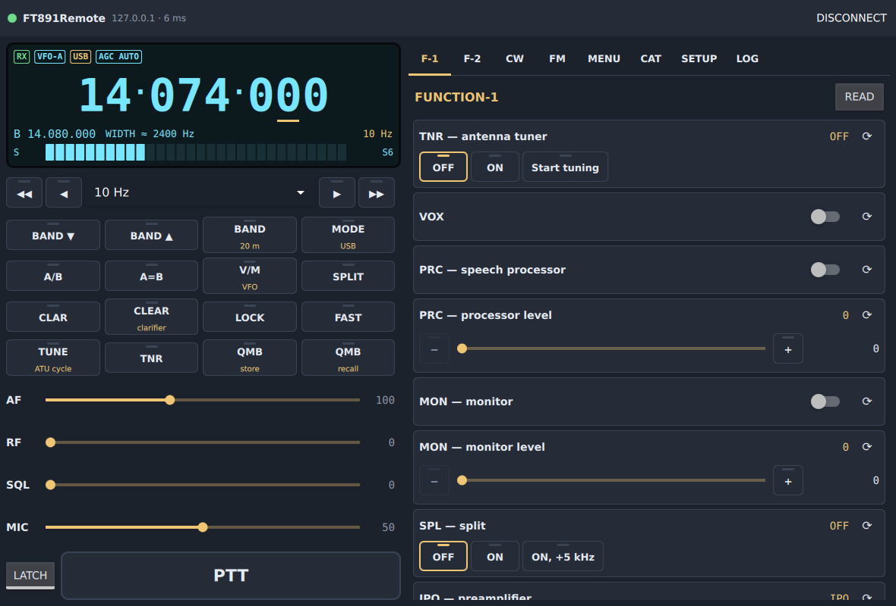
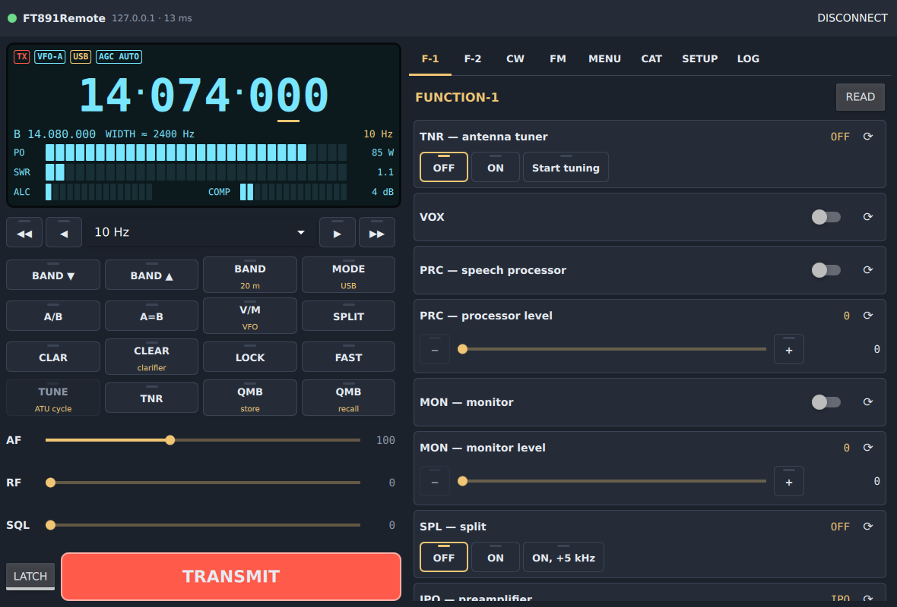
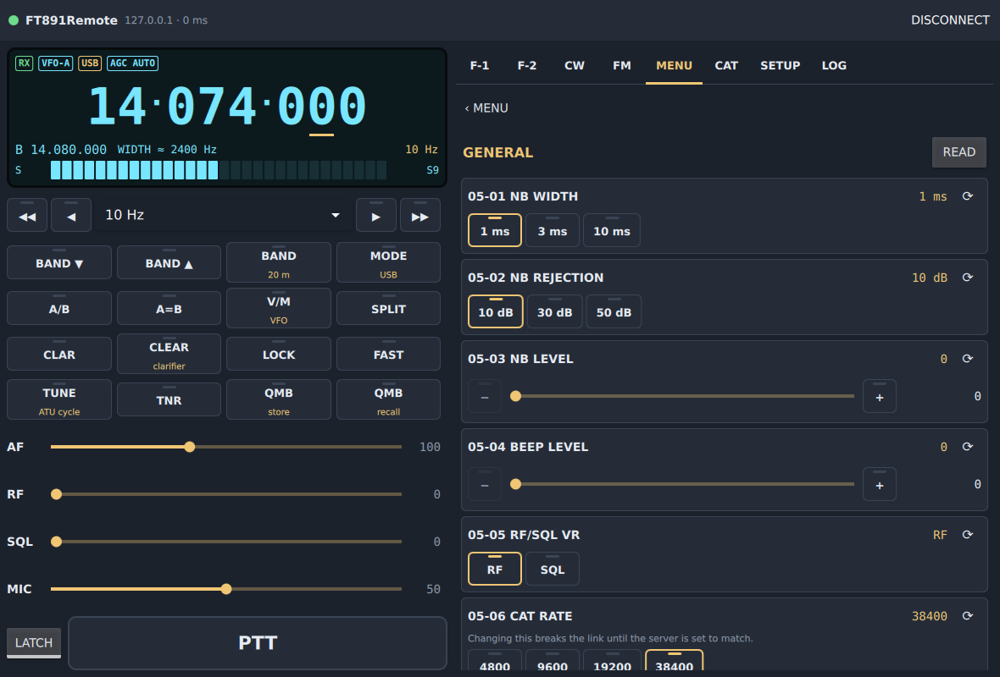
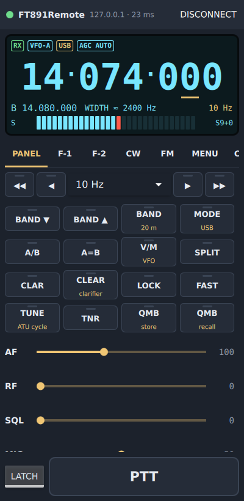
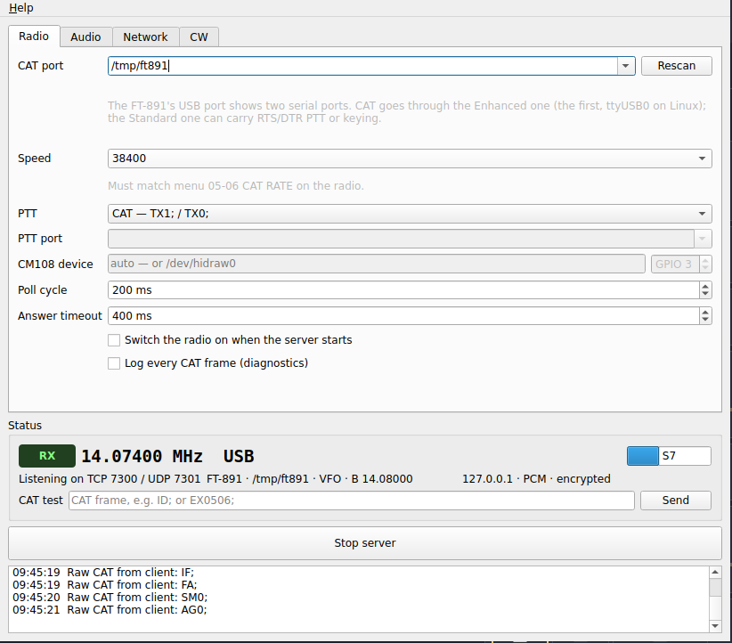

# FT891Remote

Remote operation of a **Yaesu FT-891** over a network: two-way audio, PTT,
and every setting the radio exposes over CAT — the FUNCTION keys, CW and FM
settings, the keyer memories and the whole MENU, 01 AGC to 18 VERSION — from a
desktop or an Android phone.

FT891Remote is derived from RemoteRig, a general remote-station program built
on Hamlib. This one drops Hamlib and speaks the FT-891's own CAT protocol, so
that nothing the radio can do is out of reach, and so that every control is
laid out the way the radio lays it out.

```
 FT-891 ──USB── server ──── network (TCP control, UDP audio) ──── client
         CAT    ft891remote-server                                ft891remote
         audio  (Linux, Windows, Raspberry Pi)                    (desktop, Android)
```

## Screenshots

Taken with the FT-891 simulator of `test/`, the real server and the real
client on one machine.

| Desktop client | Transmitting |
|---|---|
|  |  |

| MENU 05 GENERAL | Phone layout | Server |
|---|---|---|
|  |  |  |

## What it does

**Server** — runs next to the radio, with a window or as a headless daemon.

- Native CAT engine: answers are matched by what they say, not by the order
  requests went out, so a late answer is never credited to the wrong command.
  Operator commands go first, then read-backs, then polling, then background
  reads of the menus. A knob turned quickly sends where it stopped, not every
  step on the way.
- Polls frequency, mode, TX state and meters, and one front-panel setting per
  cycle so that a knob turned on the radio itself shows on the client.
  Notices when the radio is switched off, and reopens the serial port when a
  USB cable is pulled and put back.
- PTT through CAT (`TX1;`), RTS or DTR (on the CAT port or the FT-891's
  Standard COM port), or none (VOX).
- Guards: dead-man release if the client goes silent, transmission refused
  outside the amateur bands of the chosen IARU region (judging the emitted
  spectrum, split and clarifier included), tuner cycle and keyer messages kept
  apart from the PTT, `TX`/`MX` refused from the server's CAT test line, and a
  confirmation required for reset, CAT-rate change and power-off.
- CW typed on the client is sent by the radio's own keyer: the text is written
  into keyer memory 1 and played, fifty characters at a time. Alternatively
  the server generates the elements itself and keys a serial line.
- Two-way audio at 48 kHz, Opus or 16-bit PCM, optional ChaCha20 encryption
  — as in RemoteRig.

**Client** — one Qt Quick program for the desktop and Android.

- An LCD display with the frequency, mode, VFO-B, filter width, status flags,
  and S-meter in receive or PO, SWR, ALC and COMP in transmit.
- Tuning by mouse wheel (Shift for ten steps), drag on a touch screen, arrow
  keys on the panel, or direct entry. The tuning path is relative
  (`Radio.tune(detents)`), ready for a rotary knob.
- The MODE key offers the radio's six families — SSB, CW, AM, FM, RTTY,
  DATA. For SSB the sideband follows the band (LSB below 10 MHz, USB above
  and on 60 m); the other families come back to the variant last used
  (CW-L, DATA-L…). The display shows the mode the radio reports, read back
  after every change.
- The front-panel keys: BAND up/down and direct band, MODE, A/B, A=B, V/M,
  SPLIT, CLAR with its offset, LOCK, FAST, TUNE, TNR, QMB; AF, RF, SQL, MIC and
  PWR controls.
- Pages F-1, F-2, CW, FM and MENU, drawn from the CAT description: a switch
  for OFF/ON, segments or a list for a choice, a slider for a range, a text
  field for a keyer memory.
- MEMORY page: the radio's memories, 001–099 and the PMS pairs P1L–P9U, read
  with the rest by **Read all**. Each can be edited — frequency, mode,
  clarifier, CTCSS on/off, repeater shift, or VFO-A as it stands — written
  back to the radio, and recalled. Over CAT a memory has neither its CTCSS
  tone frequency nor its name: the FT-891 does not send or take them.
- CW page: keyboard, speed, eight macros with `{MYCALL}`, the radio's five
  keyer memories (edit and play), and the CW SETTING keys.
- A rigctld-compatible port on 127.0.0.1:4532 for WSJT-X or fldigi
  (frequency, mode, split, PTT), push-to-talk on the space bar or on the
  phone's volume-down key. Every CAT command of the radio has its control in
  the pages: the client sends no raw CAT frames.

## The radio

Connect the FT-891's USB port to the server machine. It shows two serial
ports and a sound card:

| Device | Linux | Windows | Use |
|---|---|---|---|
| Enhanced COM port | `/dev/ttyUSB0` | first COM of the pair | CAT |
| Standard COM port | `/dev/ttyUSB1` | second COM | RTS/DTR PTT or keying |
| USB Audio CODEC | ALSA / PulseAudio / PipeWire | "USB Audio CODEC" | audio |

Radio menus to check:

- **05-06 CAT RATE** — the server's speed must match (38400 recommended).
- **05-08 CAT RTS** — ENABLE is fine with CAT PTT (the server keeps RTS
  asserted on the CAT port). With RTS PTT on the CAT port it must be DISABLE;
  better, use the Standard COM port for RTS/DTR PTT.
- **11-05 SSB MIC SELECT**, **06-05 AM MIC SELECT**, **09-01 FM MIC SELECT**,
  **08-09 DATA IN SELECT** — REAR, for the modulation to come from USB.
- **11-08 SSB PTT SELECT**, **06-07 AM**, **08-10 DATA**, **09-03 PKT** —
  RTS or DTR when keying through the Standard COM port.
- For CW typed on the client: **KEYER** on, **BK-IN** on, and 04-07 CW
  MEMORY 1 on TEXT (the server sets it itself when needed).

All of these can be changed from the client's MENU page once CAT works.

## Building

Requirements: CMake 3.19+, a C++17 compiler, Qt 6.4 or later (Core, Gui,
Network, SerialPort, Widgets, Quick, QuickControls2), PortAudio, and Opus
(optional but recommended). No Hamlib.

### Linux: a Debian package (Ubuntu 24.04, Raspberry Pi OS)

```sh
./make_deb.sh --deps            # installs what is missing, builds, packages
sudo apt install ./ft891remote_<version>_<arch>.deb
sudo usermod -a -G dialout $USER      # serial port access, then log in again
```

The package holds both programs, their menu entries and icons, manual pages,
and a systemd user unit for the server. Its dependencies
are worked out by `dpkg-shlibdeps` from the libraries actually linked, so the
same script gives a correct package on Ubuntu (amd64) and on a Raspberry Pi
(arm64, armhf). Options:

| Option | Effect |
|---|---|
| `--server-only` | the station side only: no Qt Quick needed |
| `--client-only` | the front panel only: no serial port module needed |
| `--check` | run lintian on the result |
| `--deps` / `--no-deps` | install missing build dependencies without asking / never |
| `--clean` | start from an empty build directory |

To build without packaging:

```sh
sudo apt install build-essential cmake qt6-base-dev qt6-serialport-dev \
    qt6-declarative-dev qml6-module-qtquick qml6-module-qtquick-controls \
    qml6-module-qtquick-layouts qml6-module-qtquick-templates \
    qml6-module-qtquick-window qml6-module-qtqml-workerscript \
    portaudio19-dev libopus-dev
cmake -B build -DCMAKE_BUILD_TYPE=Release
cmake --build build -j
```

CMake options: `-DFT891_BUILD_SERVER=OFF` or `-DFT891_BUILD_CLIENT=OFF` to
build one side only, `-DFT891_BUILD_TESTS=ON` for the test harness.

### Windows: an installer

Install once: Visual Studio 2022 or 2026 with the "Desktop development with
C++" workload, Qt for MSVC 64-bit (Qt Quick Controls included), git, and
Inno Setup 6. Then, in an **x64 Native Tools Command Prompt**, from the project
folder:

```bat
build_all.bat /deps
```

The script installs vcpkg with PortAudio and Opus if they are missing,
configures and compiles, gathers the programs with the Qt runtime, the QML
modules, PortAudio, Opus and the Visual C++ redistributable into
`installer\dist`, and compiles `installer\FT891Remote.iss` into
`installer\output\FT891Remote-<version>-setup.exe`. Edit `QT_DIR` and
`VCPKG_ROOT` at the top of the script if yours differ.

| Option | Effect |
|---|---|
| `/deps` | install vcpkg, PortAudio and Opus first if missing |
| `/clean` | wipe the build directory first |
| `/nobuild` | skip configure and compile; deploy and package only |
| `/noinstaller` | stop after staging `installer\dist` |

The installer lets you choose the server, the client or both, installs the
Visual C++ runtime when it is missing, and can open the firewall ports.

### Android: build and install from Ubuntu 24.04

The first time, on a machine that has never built for Android:

```sh
./build_android.sh --setup --install
```

`--setup` installs the JDK, git and adb's udev rules with apt, Qt for Android
and the desktop Qt it needs with aqtinstall (in a Python virtual environment),
the Android SDK platform, build tools, NDK and platform-tools with sdkmanager,
and creates the signing key (keep it: an update must carry the same key as the
version it replaces). What is already installed is kept, so it can be run
again. Then the script compiles — Oboe and Opus are fetched and built from
source — packages, signs, and installs on the phone connected by USB, with USB
debugging enabled.

Afterwards:

```sh
./build_android.sh --install       # build, sign, install
./build_android.sh --reinstall     # ... removing the previous install first
./build_android.sh --logcat        # ... and follow the application's log
./build_android.sh --no-sign       # stop at the unsigned APK
```

Paths and versions (Qt 6.11.2, NDK 27.2.12479018, SDK platform 36) are
variables at the top of the script, each overridable from the environment.

## Running

### Server

Start `ft891remote-server`, check the CAT port and speed, the PTT method,
the audio devices, choose a password, and press **Start server**. The serial
ports are scanned when the window opens. The FT-891's USB chip, a CP2105, is
also the one in Yaesu's SCU-17, with the same identifiers: until the radio
has answered, its ports are shown as "CP2105 Enhanced COM" and "CP2105
Standard COM" with their serial number, and none is selected on its own —
choose the Enhanced one for CAT. Once the FT-891 has answered on it, the
server remembers its serial number, labels both ports "FT-891", follows the
radio to another COM number, and offers its Standard port for the local
keyer. **Rescan** looks again after the radio is plugged in. The status box
shows the frequency and meters as the server reads them, and a **CAT test**
line sends a frame straight to the radio.

Once configured, the same settings run without a display:

```sh
ft891remote-server --headless            # the settings saved by the window
ft891remote-server --headless -v         # ... and log frequency changes
ft891remote-server --headless --config station.ini
ft891remote-server --list-audio          # device names for the .ini
ft891remote-server --list-ports
systemctl --user enable --now ft891remote-server
```

An `.ini` uses the same keys the window saves, for example:

```ini
[General]
catPort=/dev/ttyUSB0
catBaud=38400
; CAT, RTS, DTR or NONE. pttPort empty: the CAT port itself.
pttMethod=CAT
pttPort=
password=choose-one
tcpPort=7300
udpPort=7301
audioIn=USB Audio CODEC
audioOut=USB Audio CODEC
; IARU region of the band-edge guard.
region=1
bandEdges=true
```

QSettings reads comments only on lines of their own: nothing may follow a
value on its line.

Forward TCP 7300 and UDP 7301 to the server to reach it from outside, and
turn encryption on. On a local network or through a VPN it can stay off.

### Client

Start `ft891remote`, open **SETUP**, enter the server's address and password,
and **Connect**. The panel fills in as the server reads the radio; the MENU
sections are read when you open them, or all at once with **Read all**.

## Tests

`test/ft891_sim.py` simulates the radio on a pseudo-terminal and
`ft891-cattest` drives the CAT engine against it — or against the real radio;
`ft891-portstest` checks the recognition of the FT-891's serial ports.
`ft891-fieldtest` runs every check still to be made on a real radio, guided,
after saving the radio's settings, menus and memories, which it puts back at
the end (see `test/README.md`).
See [test/README.md](test/README.md).

## The CAT description

Every setting lives in [data/cat/ft891.json](data/cat/ft891.json), embedded
in both programs; its format is in [data/cat/FORMAT.md](data/cat/FORMAT.md).
The description was checked, command by command, against the FT-891 CAT
Operation Reference Book (1909-C), and every command was tried on a real
FT-891. The memories are read with `MR`, written with `MW` and recalled with
`MC`; they are not in the description, a memory being a record rather than a
setting.

Where the reference and the radio disagree, the radio wins:

- RF GAIN runs 0–30 (the reference says 000–100);
- IF SHIFT and WIDTH carry an ON/OFF digit the reference does not show
  (`IS01+0500;`, `SH0114;`);
- a TEXT keyer memory is played by `KY6`–`KYA`, a MESSAGE memory by
  `KY1`–`KY5`;
- the channel field of an `MR` answer holds the radio's current memory
  channel, not the channel read: the memories are read one at a time, and
  each answer is filed under the channel asked for;
- band keys: `BS00` = 160 m … `BS10` = 6 m, `BS11` = GEN, `BS12` = MW; 60 m
  has no band-stack key and is reached by its preset frequency.

The WIDTH steps, and the bandwidth each gives, follow the SH table of the CAT
reference: they depend on the mode and on NARROW (SSB 09–21, or 01–09 narrow;
CW, RTTY and DATA 10–17, or 01–10 narrow; none in AM and FM), and the client
offers only the steps the current mode has.

## Differences from RemoteRig

- No Hamlib: the server drives the FT-891 directly, and only the FT-891.
- A new control protocol (magic `F891`): the two programs do not talk to each
  other. The audio path, the encryption and the handshake are RemoteRig's.
- One Qt Quick client for desktop and Android instead of a Widgets client and
  a touch client.
- The server's window and daemon share one wiring class and one settings
  loader.

## Licence

MIT — see [LICENSE.txt](LICENSE.txt). FT891Remote contains code from
RemoteRig, under the same licence.

Yaesu and FT-891 are trademarks of their owner, used here only to say which
radio this software works with. This project is not affiliated with or
endorsed by Yaesu.
